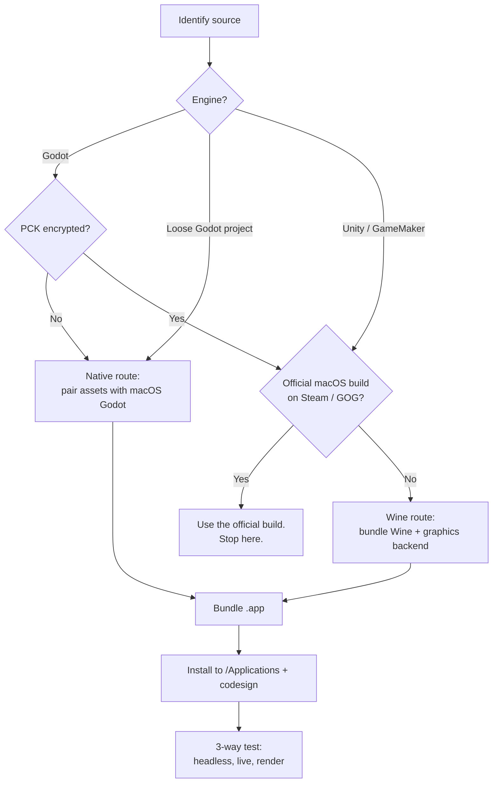

# game-to-mac

Port a non-macOS game — Android APK, Windows Godot/Unity/GameMaker build, or a loose
project folder — into a runnable macOS `.app` installed in `/Applications`.

This is a **skill**, not an application. It is a single `SKILL.md` playbook that an AI
coding agent reads and executes. There is nothing to compile and no runtime dependency
beyond the tools listed under [Requirements](#requirements).

Default assumption: the source is an **Android APK built with Godot Engine 4.x**. The
playbook detects other formats and routes them accordingly.

---

## Contents

- [How it works](#how-it-works)
- [Requirements](#requirements)
- [Install](#install)
- [Usage](#usage)
- [Support matrix](#support-matrix)
- [Caveats](#caveats)
- [License](#license)

---

## How it works

The core insight: **game assets are usually platform-independent; only the engine binary
is platform-specific.** A Godot `.pck` (or the `assets/` tree inside an APK) is just
packed resource data — the same bytes run on Windows, Linux, Android, or macOS. So the
port is mostly a matter of **pairing the assets with a macOS engine binary of a matching
version**, then cleaning up the platform-specific bits that no longer apply.

When no macOS engine exists to host the assets (closed-source Unity / GameMaker players),
the playbook falls back to **running the original Windows `.exe` through a self-contained
Wine bundle** shipped inside the `.app`.

### Route selection



### Route A — native Godot (always preferred)

1. **Inspect** — `unzip -l game.apk`; read engine version from `assets/_cl_`; note
   plugins under `assets/addons/`.
2. **Extract** — pull out the `assets/*` tree and flatten it.
3. **Convert settings** — Android/Windows exports ship a binary `project.binary`. Run a
   three-line `dump_settings.gd` under a desktop Godot binary to emit a text
   `project.godot` you can actually edit.
4. **Fix project settings** — resolve `run/main_scene` (usually a `uid://` reference that
   must be resolved to a real `.tscn`), prune dead autoloads, set icon and audio bus.
5. **Neutralize platform-only extensions** — an Android export ships only `.so` files and
   a Windows export only `.dll` files. The macOS `.dylib` is simply absent, so the
   extension must be stubbed or disabled or the launch dies.
6. **Preserve the `.godot/` cache** — this is the single biggest cause of broken ports.
   It holds compiled `.scn` files, the UID cache, and the `class_name` registry. Opening
   the project in the desktop editor can silently wipe it.
7. **Bundle** — `Info.plist`, launcher script, generated `.icns`.
8. **Install and sign** — copy to `/Applications`, then ad-hoc `codesign` the whole bundle.
9. **Test three ways** — headless parse, live-alive check, and a render check that proves
   real pixels were drawn. All three must pass before you call it done.

### Route B — Wine wrapper (when there is no macOS engine)

1. **Check Steam/GOG for a native macOS build first.** Many "Windows-only" indie games
   have one. This beats every workaround below.
2. **Bundle a gcenx Wine build** inside `Contents/Resources/wine`. Do not depend on the
   user installing Whisky / CrossOver / Homebrew Wine — those sources break behind
   proxies and dead CDNs.
3. **Create a prefix** with `wineboot -u` (plain `wine cmd` will not create `drive_c`).
4. **Install the right graphics backend.** This is where nearly all the effort goes, and
   the correct choice depends on the engine — see the [support matrix](#support-matrix).
5. **Handle the repack layer.** GoldBerg / TENOKE are offline and fine. OnlineFix will
   silently kill the game unless you force Wine's builtin `winmm` and supply an offline
   Steam API emulator.

### Why the testing step is non-negotiable

A port can "launch" and still draw a black screen, or exit after 60 seconds because a
Steam emulator gave up. The playbook therefore requires objective evidence:
`Player.log` exists, the process is still alive after N seconds, and pixel statistics
prove non-black frames. **Never claim a render fix from eyeballing a screenshot** —
build a numeric gate instead.

---

## Requirements

Verified on **macOS with Apple Silicon (M1 Pro)**. Intel Macs should work but are not
the tested reference.

### Native Godot route

| Need | Notes |
| --- | --- |
| Godot binary | `/Applications/Godot.app`, or download a version-matched build. **Must match the game's `major.minor`** (patch may differ) or the engine refuses the PCK. |
| `unzip`, `bsdtar` | `bsdtar` handles RAR (including multi-part) with no extra tooling. |
| `codesign`, `xattr` | Xcode Command Line Tools. |
| Python + Pillow | For icon generation and pixel-statistics testing. `iconutil` is unreliable. |

### Wine route

| Need | Notes |
| --- | --- |
| Rosetta 2 | Apple Silicon runs the x86_64 Wine build under translation. |
| gcenx Wine build | ~849 MB per bundle. Reuse an existing one with `cp -Rc` (APFS clone, instant, copy-on-write). |
| MoltenVK | Ships with the gcenx build. This is the only Vulkan path — there is no vkd3d. |
| Disk space | Budget ~1 GB per ported game. |

### Network

GitHub release downloads often stall behind a proxy. Use the
`https://ghfast.top/https://github.com/...` mirror — it pulled a 161 MB Godot zip in
~20s where the direct URL hung after ~400 KB.

---

## Install

`game-to-mac` is a directory with no build step: `SKILL.md` (the playbook), this
`README.md`, a `.gitignore`, and a `LICENSE` (MIT). Any agent that loads skills from a
directory will understand it — there is no vendor-specific format beyond the YAML
frontmatter at the top of `SKILL.md`.

```bash
# Claude Code
cp -R game-to-mac ~/.claude/skills/game-to-mac

# Codex
cp -R game-to-mac ~/.codex/skills/game-to-mac

# WorkBuddy
cp -R game-to-mac ~/.workbuddy/skills/game-to-mac
```

Or clone it straight into place:

```bash
git clone https://github.com/skawaks/game-to-mac.git ~/.workbuddy/skills/game-to-mac
```

---

## Usage

Just describe the goal and give a path:

- "Port this game to mac"
- "Make this APK run on mac"
- "Convert this APK to a mac app"
- "移植到 mac"

Then hand over the source file. The agent drives the rest — detection, extraction,
packaging, signing, verification.

---

## Support matrix

### Tested working

| Source | Route | Verified on | Result |
| --- | --- | --- | --- |
| Android APK, Godot 4.x | Native | Godot 4.x / Apple Silicon | ✅ Full native `.app` |
| Godot HTML5/WASM in APK | Native | `index.pck` + matching Godot binary | ✅ Full native `.app` |
| Loose Godot project folder | Native | — | ✅ Full native `.app` |
| Windows Godot, **unencrypted** PCK | Native | Smashing Bottles (Godot 4.6.2, M1 Pro, Metal 4.0 Forward+) | ✅ Full native `.app`, better than Wine |
| Windows Godot, **encrypted** PCK | Wine | `gamblers-table` (Godot 4, SteamRIP) | ⚠️ Runs via Wine; CJK needs the font fix |
| GameMaker Studio 2 (`data.win`) | Wine + **DXVK-macOS async 1.10.3** | How Many Dudes (M1 Pro) | ✅ Only working config — see [caveats](#caveats) |
| Unity 6 (6000.4.x) Mono | Wine + DXVK-macOS 1.10.3, `-force-d3d11` | How to Fish (6000.4.4f1) | ✅ No GL shim needed |
| Unity 2022.3 Mono | Wine + DYLD OpenGL shim | Demon Lord: Just a Block | ✅ wined3d reports D3D 11.0 level 10.1 |

### Partially working

| Source | Status |
| --- | --- |
| Unity IL2CPP, TENOKE repack | Engine initializes, `Player.log` written, repack init OK. Rendering not confirmed headless — `d3d11: failed to create device (80004005)` is usually just "no display in sandbox". Must be confirmed on a real Mac. |

### Currently unsolvable

Know these before you burn hours on them.

| Case | Why it's stuck |
| --- | --- |
| **Encrypted Godot PCK, key unavailable** | The 32-byte AES key lives in the engine binary, never in the `.pck`. No key, no decrypt, no native rebuild. Wine is the only route. |
| **Unity IL2CPP, D3D11, Apple Silicon** | Every D3D11 path fails: wined3d returns a silent `80004005`; DXVK ≥3.0 needs `geometryShader` (MoltenVK lacks it); DXVK 1.10.3 lacks D3D FL11_0; `-force-vulkan` / `-force-glcore` report "not built from editor" because the player ships D3D11 only. **Check Steam/GOG for a native macOS build before trying anything.** |
| **GameMaker via wined3d or D3DMetal** | wined3d gives 100% black screen + audio (7 registry combos tried, all failed). D3DMetal crashes on `CheckMultisampleQualityLevels` `0x80070057`. Only DXVK-macOS async 1.10.3 works. |
| **D3D12** | The bundled gcenx Wine has no vkd3d-proton, so D3D12 is unusable. Unity 6 additionally enforces D3D12 Feature Level 12.1. |
| **Stock DXVK 2.x / 3.x on Apple GPUs** | Hard-requires Vulkan 1.3 + geometry/tessellation shaders. MoltenVK exposes neither. Device init aborts. |
| **Online co-op / achievements under Wine** | Needs a reachable Steam client, which a macOS Wine prefix cannot provide. Single-player is fine; multiplayer is not. |
| **Native rebuild of Unity / GameMaker** | Impossible without the original project. There is no open engine to host those assets on macOS — unlike Godot. |

---

## Caveats

Condensed rules. `SKILL.md` §14 keeps the full dated, evidence-backed log — read it
before attempting an unfamiliar engine.

**Assets**
- Copy dotfiles explicitly: `cp -R "src/." "dst/"`. Shell globs skip `.godot/` and that
  kills the port.
- Never let the desktop editor touch the project before you have a pristine copy of
  `.godot/` from the original archive.

**Signing**
- Always `codesign --force --deep --sign -` as the **last** step, after every edit.
- A copied Godot binary SIGKILLs with exit 137 and no output if left unsigned —
  AMFI kills it before any banner prints.
- **Do not** ad-hoc sign Wine bundles. The Steam emulator writes inside the bundle at
  runtime and breaks the seal, so Gatekeeper reports the app as damaged. Use
  `xattr -dr com.apple.quarantine` and have the user approve once via
  System Settings → Privacy & Security → Open Anyway.

**Extensions and autoloads**
- Disabling a `.gdextension` takes three steps, not one: rename the file, remove the
  `[editor_plugins]` line that force-enables it, and delete the stale
  `.godot/**/extension_list.cfg` entry.
- Delete dead autoloads. Dev-only tooling (e.g. MCP addons) is listed as autoloads but
  its `.gd` files are not exported, which yields "Failed to instantiate autoload".
- OnlineFix repacks: force `WINEDLLOVERRIDES="winmm=b"` so the proxy never loads, and
  replace the real `steam_api64.dll` with an offline emulator (GoldBerg). Skip either and
  the game dies after 30–60s with no `Player.log` at all.

**Graphics backends on Apple Silicon**
- GameMaker → DXVK-macOS async 1.10.3 only. Copy just `d3d11.dll` + `d3d10core.dll`,
  keep Wine's builtin `dxgi`, set `WINEDLLOVERRIDES="d3d11=n,b"` (not `d3d11,dxgi=n,b`),
  and `DXVK_ASYNC=1`.
- Unity 6 Mono → DXVK 1.10.3, `-force-d3d11`. No GL shim.
- Unity 2022.3 Mono → wined3d plus a `DYLD_INSERT_LIBRARIES` shim that fakes
  `GL_EXT_shader_integer_mix` and `GL_ARB_polygon_offset_clamp`.
- Verify the downloaded DXVK tarball with `tar -tzf`. Behind a proxy the direct GitHub
  URL can silently return a truncated ~2.7 MB file.

**Verification**
- `--quit-after <sec>` is the only reliable timeout on macOS — `timeout` is not installed.
  A heavy engine can also be SIGKILLed (137) inside a tool sandbox; re-run with the
  sandbox disabled.
- `Player.log` is the fastest go/no-go for Unity:
  `<prefix>/drive_c/users/<user>/AppData/LocalLow/<Company>/<Product>/Player.log`.
  No log after 60s means the game died before or inside engine init.
- Launch test apps with `open -a "/Applications/X.app"`, never `nohup ... &` —
  LaunchServices detaches the process so it survives between tool calls.
- Judge rendering numerically (`dark_fraction`, `distinct_color_buckets`), not visually.
  A bright error dialog also scores as "rendering", so always cross-check window size
  and log contents.

**Misc**
- Wine prefix init needs `wineboot -u`; `wine cmd` will not create `drive_c`.
- Use `bsdtar` for RAR — there is no `unrar`.
- `iconutil` chokes on some PNGs. Generate `.icns` with Pillow instead.
- Reuse a Wine bundle via `cp -Rc` (APFS clone) — instant, and the copy is independent.
- Set `LANG`/`LC_ALL` and add Wine font replacements for CJK in **Godot** Windows builds.
  GameMaker and Unity games ship their own fonts and need none of this.

---

## Contributing

The pitfalls log in `SKILL.md` §14 is append-only and is the most valuable part of this
repo. If a port fails in a new way, or you find a fix, add a dated entry with what
broke, what fixed it, and how you verified it. Pull requests welcome.

## License

MIT.
